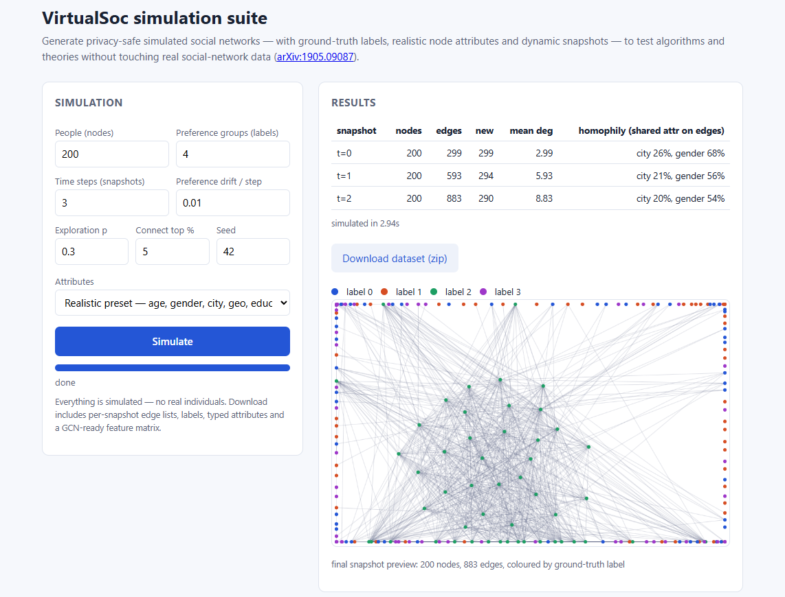

# VirtualSoc

**Simulate dynamic social networks — with ground-truth labels and realistic
node features — so researchers can test algorithms and theories without
accessing real social-network data.**

VirtualSoc is the open-source simulation library of the paper
[*Simulation and Augmentation of Social Networks for Building Deep Learning
Models*](https://arxiv.org/abs/1905.09087). Network topology is driven by
latent node preferences (the **social DNA, sDNA**) which double as
ground-truth class labels; features, labels and structure are generated
*coupled together*, the way they are entangled in real social networks.

## The simulation suite (web UI + API)



```bash
pip install -r requirements.txt
python webapp.py          # open http://127.0.0.1:5000
```

Set the number of people, preference groups, time steps (snapshots with
sDNA preference drift between them) and attributes — hit **Simulate** —
watch live progress — download the dataset. Every download is a
ready-to-use research bundle:

| file | contents |
|---|---|
| `edges_t{K}.csv` | undirected edge list of snapshot K (dynamic networks) |
| `labels.csv` | ground-truth node labels (sDNA groups) |
| `features_typed.json` | realistic attribute values per node |
| `features_encoded.csv` | numeric feature matrix (GCN-ready) |
| `stats.json` | per-snapshot statistics incl. per-attribute homophily |

The same functionality is scriptable over HTTP — `POST /api/simulate`,
`GET /api/jobs/<id>` (progress), `.../result`, `.../download` — see the
docstring in [`webapp.py`](webapp.py) for the request format. The web
layer never executes user-supplied code and enforces hard parameter
limits. All generated data is simulated: it contains no real
individuals and is safe to share.

## Realistic, typed features

Networks can be simulated with **typed real-world attributes** compared by
type-aware dissimilarities inside the sDNA score (see
[`RealFeatures.py`](RealFeatures.py)):

| type | example | dissimilarity |
|---|---|---|
| numeric | age, education | abs. difference / range |
| binary / categorical | gender, city | match / mismatch |
| geo | (x, y) position | euclidean distance |
| multihot | interest sets | 1 − Jaccard overlap |

```python
from RealFeatures import RealFeatureSchema
from Networks import RandomSocialGraphAdvanced

schema = RealFeatureSchema.default_social()   # age, gender, city, geo,
                                              # education, interests
G = RandomSocialGraphAdvanced(labelSplit=[50, 100, 150, 200],
                              realFeatureSchema=schema,
                              useGPU=False, createInGPUMem=False)
```

sDNA semantics are unchanged (per-feature prefer-similar/dissimilar and
weight, mutation for dynamics, labels), and every node also carries a flat
numeric encoding (`node.features`) so exports and GCN training work as
before. A custom feature is one `FeatureSpec(name, kind, sampler, ...)`.
Full example: [`ScriptRealFeaturesNetwork.py`](ScriptRealFeaturesNetwork.py).

## Library usage

- Abstract-feature simulation (as in the paper): `ScriptSingleNetwork.py`
  (single network) and `ScriptMultiNetwork.py` (batches).
- CuPy/CUDA is optional: without CuPy everything runs on the CPU
  automatically; install `cupy-cuda12x` to enable GPU-accelerated scoring.
- Tests: `python -m pytest tests` (19 tests).

Sample generated datasets: `data_sample.zip` in this repo and many more on
[Kaggle](https://www.kaggle.com/akandaashraf/virtualsoc1). To compute
graph statistics for generated networks, the standalone `rscript` is
included (R, with its own dependencies; not part of the library).

## The paper

> A. Wahid-Ul-Ashraf, M. Budka, K. Musial,
> *Simulation and Augmentation of Social Networks for Building Deep
> Learning Models*, [arXiv:1905.09087](https://arxiv.org/abs/1905.09087).

Related: the gravitational link-prediction method by the same authors has
its reference implementation at
[AkandaAshraf/akanda-method](https://github.com/AkandaAshraf/akanda-method)
— including the GCN augmentation from this paper evaluated on Cora.

This work comes from the author's PhD research, funded by Bournemouth
University, supervised by the paper's co-authors.
